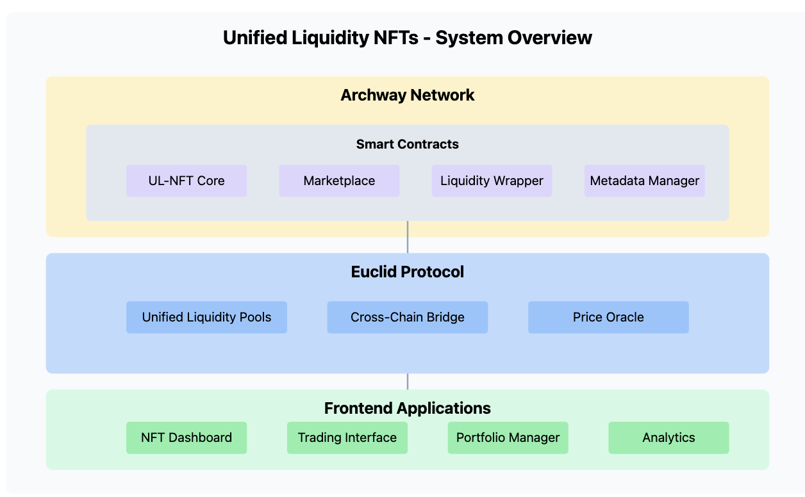
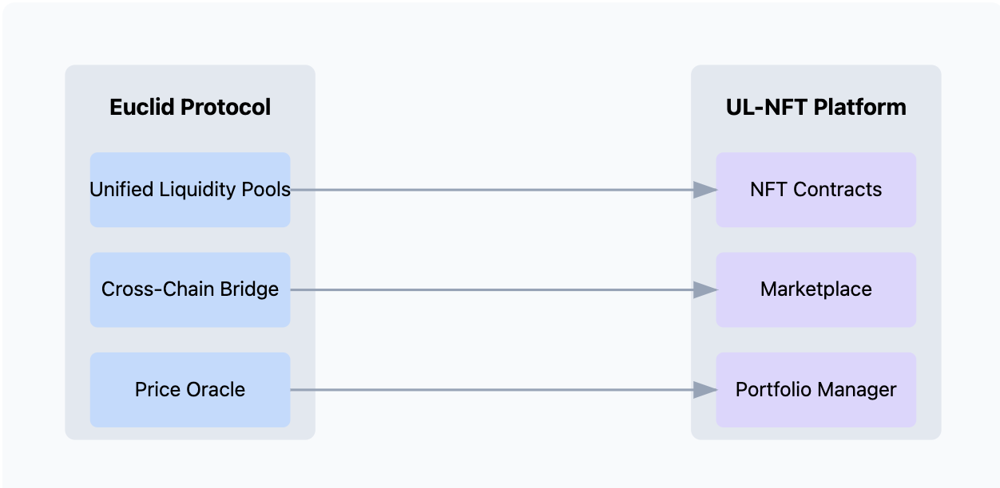
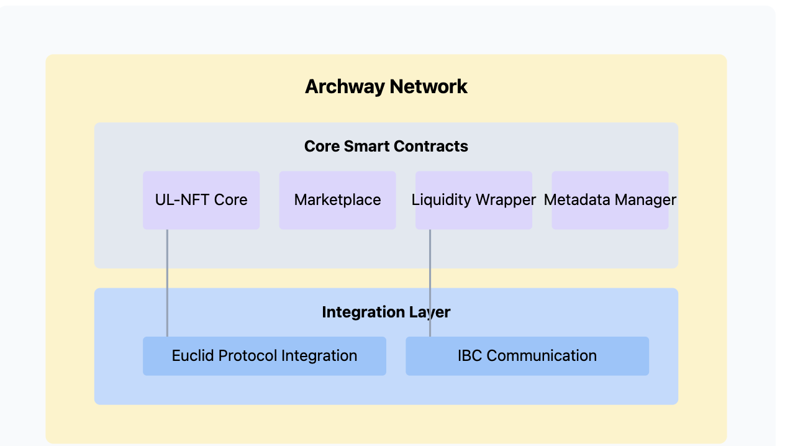

# Unified Liquidity NFTs (UL-NFTs)

<div align="center">

</div>

## 🌟 Overview

UL-NFTs (Unified Liquidity NFTs) is a groundbreaking DeFi project that tokenizes Euclid Protocol's unified liquidity pools into tradeable NFTs. Built on Archway, it enables users to easily trade complex cross-chain liquidity positions through a simplified NFT interface.

### Key Features

- 🎯 Tokenized liquidity pool positions
- 🔄 Cross-chain liquidity management
- 🏪 NFT marketplace for trading positions
- 📊 Portfolio management dashboard
- ⚡ Instant liquidity provision

## 🏗️ Project Structure

```bash
unified-liquidity-nfts/
├── .github/
│   └── workflows/              # CI/CD workflows
├── contracts/
│   ├── Cargo.toml              # Workspace manifest
│   ├── ul-nft-core/            # Core NFT contract
│   │   ├── Cargo.toml
│   │   └── src/
│   │       ├── contract.rs     # Main contract logic
│   │       ├── error.rs        # Custom errors
│   │       ├── msg.rs          # Message definitions
│   │       └── state.rs        # Contract state
│   ├── marketplace/            # NFT marketplace contract
│   │   ├── Cargo.toml
│   │   └── src/
│   │       └── ...
│   ├── liquidity-wrapper/      # Euclid integration contract
│   │   ├── Cargo.toml
│   │   └── src/
│   │       └── ...
│   └── metadata-manager/       # NFT metadata contract
│       ├── Cargo.toml
│       └── src/
│           └── ...
├── frontend/
│   ├── package.json
│   ├── public/
│   └── src/
│       ├── components/         # React components
│       ├── hooks/              # Custom hooks
│       ├── services/           # API/blockchain services
│       └── pages/              # Main application pages
├── scripts/
│   ├── deploy.ts               # Deployment scripts
│   └── test.ts                 # Test runners
└── docs/                       # Additional documentation
```

## 🔄 System Architecture

<div align="center">


_System Architecture Diagram_

</div>

### Architecture Components

1. **Archway Layer**

   - Hosts all smart contracts
   - Handles NFT minting and transfers
   - Manages marketplace operations
   - Provides rewards for contract usage

2. **Euclid Protocol Integration**

   - Unified liquidity pools
   - Cross-chain communication
   - Liquidity position management
   - Price discovery and execution

3. **Smart Contracts**

   - `ul-nft-core`: NFT implementation
   - `marketplace`: Trading functionality
   - `liquidity-wrapper`: Euclid integration
   - `metadata-manager`: NFT metadata

4. **Frontend Application**
   - User interface for NFT trading
   - Portfolio management dashboard
   - Liquidity position analytics
   - Wallet integration

## 🌊 Euclid Protocol Integration

<div align="center">


_Euclid Integration Flow_

</div>

### How Euclid is Used

1. **Liquidity Pool Access**

   ```rust
   // Interaction with Euclid's unified liquidity pools
   pub struct LiquidityPosition {
       pool_id: String,
       chain_id: String,
       amount: Uint128,
       token_pair: (String, String),
   }
   ```

2. **Cross-Chain Operations**

   - Utilizes Euclid's messaging protocol
   - Manages liquidity across multiple chains
   - Handles position aggregation

3. **Price Discovery**
   - Leverages Euclid's unified price feed
   - Ensures accurate NFT valuations
   - Manages slippage control

## ⚡ Archway Integration

<div align="center">


_Archway Contract Architecture_

</div>

### Why Archway?

1. **Smart Contract Rewards**

   - Automatic rewards distribution
   - Gas fee optimization
   - Premium features for stakers

2. **CosmWasm Environment**

   - Robust contract development
   - Strong security guarantees
   - IBC protocol support

3. **Cross-Chain Capabilities**
   - IBC protocol integration
   - Message passing between chains
   - State synchronization

## 🚀 Getting Started

### Prerequisites

```bash
# Install Rust
curl --proto '=https' --tlsv1.2 -sSf https://sh.rustup.rs | sh

# Install Archway CLI
curl -sSfL https://raw.githubusercontent.com/archway-network/archway/main/scripts/install-cli.sh | sh

# Install Node.js dependencies
cd frontend && npm install
```

### Development Setup

1. **Clone the Repository**

   ```bash
   git clone https://github.com/yourusername/unified-liquidity-nfts
   cd unified-liquidity-nfts
   ```

2. **Build Contracts**

   ```bash
   cd contracts
   cargo build
   cargo test
   ```

3. **Start Frontend**
   ```bash
   cd frontend
   npm run dev
   ```

## 🔗 Contract Interaction Flow

<div align="center">


_Smart Contract Interaction Flow_

</div>

### Flow Description

1. User initiates NFT minting
2. System queries Euclid for position data
3. NFT contract mints token with position
4. Marketplace enables trading
5. Liquidity wrapper manages position changes

## 🛠️ Development Commands

```bash
# Build all contracts
make build

# Run tests
make test

# Deploy contracts
make deploy

# Start local development
make dev

# Generate documentation
make docs
```

## 🤝 Contributing

See [CONTRIBUTING.md](./CONTRIBUTING.md) for details on:

- Code style guide
- Development workflow
- Testing requirements
- Pull request process

## 📃 License

This project is licensed under the Apache License 2.0 - see the [LICENSE](./LICENSE) file for details.
